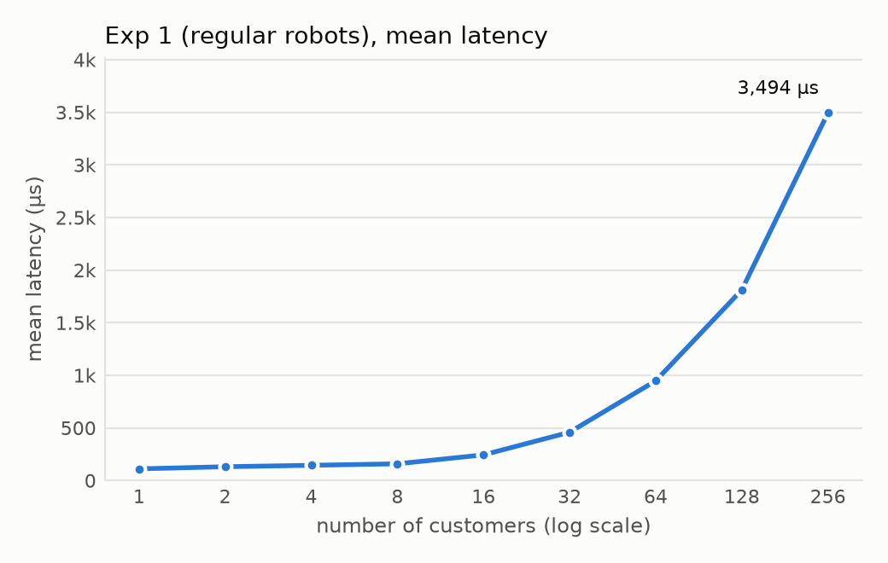
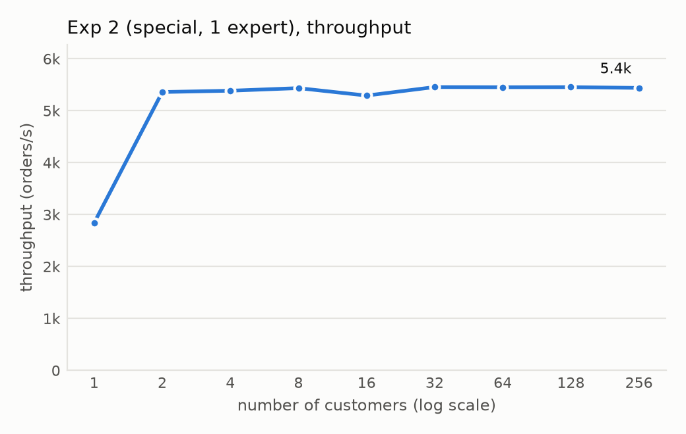
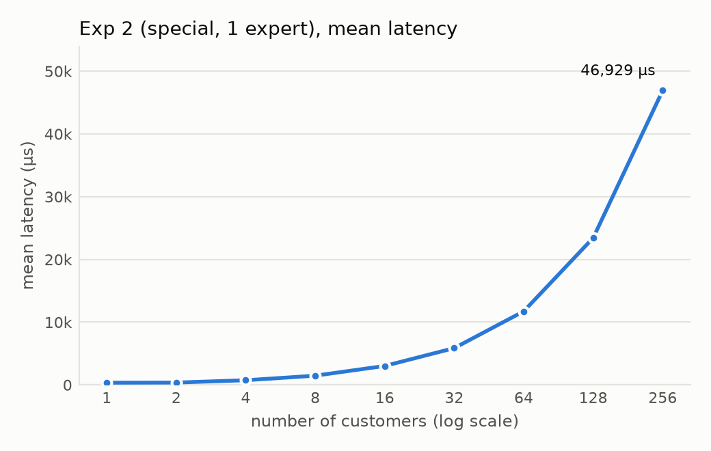
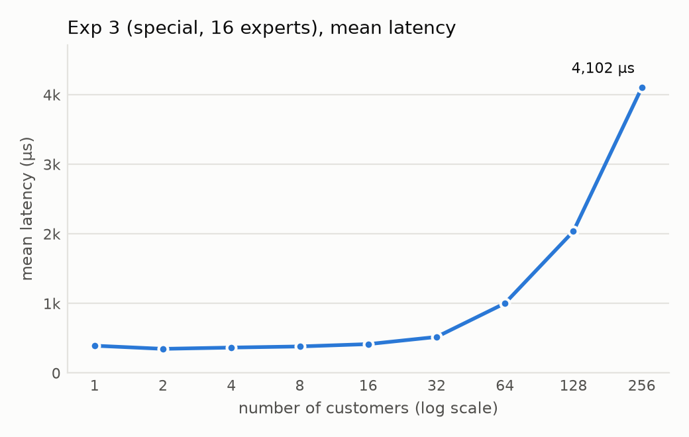
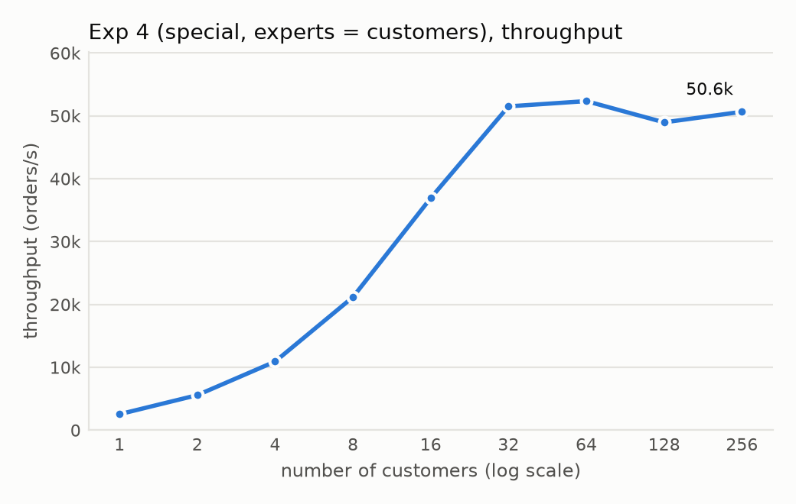
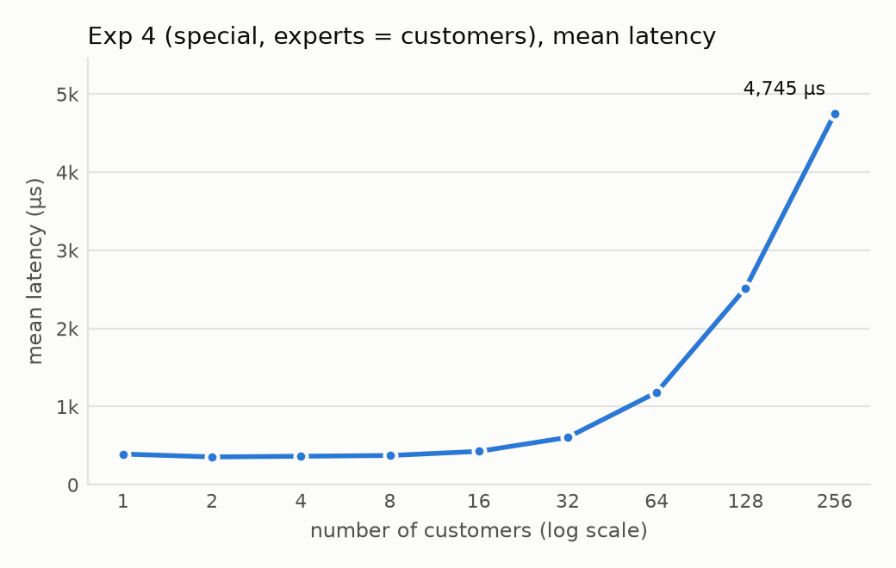

# Multi-Threaded C++ RPC Server

A from-scratch client–server RPC system over raw TCP sockets in C++: hand-written wire format, RPC stubs, a thread per connection, and a shared worker pool coordinated with a mutex, a condition variable, and `std::promise`/`std::future` hand-off. It comes with a load generator and a benchmark harness, measured across two 4-core Linux machines.

**Highlights**
- **68K requests/s** sustained across two machines with 256 concurrent clients.
- Diagnosed and fixed a throughput collapse of **up to 170x**: multi-second tail latency at 256 clients traced to TCP listen-backlog overflow; raising the backlog from 8 to 1024 brought max latency down from seconds to **38 ms**.
- Found the bottleneck and scaled it: going from **1 to 16 workers lifted throughput ~11x** (5.4K → 62K req/s) for requests that need a worker.
- Every number checked against **Little's Law** across **36 benchmark runs**; clean under **ThreadSanitizer** and **AddressSanitizer**.

## Why this project matters

Every backend service, from a payments API to an LLM inference server, runs the same small loop: accept connections, turn bytes into requests, hand work to a limited pool of workers, and send results back to the right caller. Frameworks such as gRPC hide that loop. This project builds it by hand, and that exposes the problems frameworks normally solve for you:

| Problem | Where it shows up here | What the project does about it |
|---|---|---|
| TCP is a byte stream, not a message stream | One `recv` can return half a request | `SendAll`/`RecvAll` loop until exactly *n* bytes have moved |
| Machines disagree on byte order | Raw structs differ between hosts | Every field is marshalled with `htonl`/`ntohl`; structs never go on the wire |
| A slow shared resource caps the whole system | One worker serves every client | Shared FIFO queue + worker pool; measured how throughput scales with pool size |
| Results must reach the caller that asked | Many connections share one queue | Each job carries a `std::promise`; the connection thread waits on its own `future` |
| The kernel queues work before your code sees it | Connection bursts overflow the accept queue | Found by measuring tail latency, fixed by sizing the listen backlog |
| Benchmarks can lie | Lock contention or skew in the load generator | Per-thread stats with no locks on the hot path; results cross-checked with Little's Law |

## Architecture

```
 client machine                                    server machine
┌──────────────────────────┐  TCP: 12 B request  ┌─────────────────────────────────────────────┐
│ N client threads          │       20 B response │ accept loop                                 │
│  each owns a ClientStub ──┼────────────────────►│  └─ one thread per connection               │
│  one request in flight    │                     │       ServerStub: ReceiveOrder / ShipRobot  │
│  per-thread latency stats │◄────────────────────┼────── inline request  → handled on the spot │
└──────────────────────────┘                     │       worker request:                       │
                                                  │         push {job, promise} ──┐             │
                                                  │         wait on its future    │             │
                                                  │  shared FIFO queue ◄──────────┘             │
                                                  │  (mutex + condition variable)               │
                                                  │  worker pool of size E                      │
                                                  │    pop → do the work → promise.set_value()  │
                                                  └─────────────────────────────────────────────┘
```

The code uses a small order-fulfilment domain: an **order** is a request, a **robot** is the response, **engineers** are the per-connection threads, and **experts** are the shared worker pool. A *regular* order is handled inline by the connection thread; a *special* order also needs one of the workers.

| Layer | Files | Design |
|---|---|---|
| Wire format | `Message.h/.cpp` | Fixed-size messages (`Order` = 3 × int32, `RobotInfo` = 5 × int32), marshalled field by field in network byte order. |
| Transport | `Socket.h/.cpp` | Move-only RAII wrapper around one fd, so every connection has exactly one owner and is closed exactly once. Exact-length send/receive loops; `MSG_NOSIGNAL` so a client that disconnects can't kill the server with `SIGPIPE`; `SO_REUSEADDR`; listen backlog 1024. |
| RPC stubs | `ClientStub.*`, `ServerStub.*` | `OrderRequest()` on the client, `ReceiveOrder()` / `ShipRobot()` on the server. They return `bool`, so "peer closed the connection" is distinguishable from a real message. |
| Concurrency | `ServerFactory.h/.cpp` | Thread per connection. A single FIFO queue guarded by a mutex; workers block on a condition variable with a predicate (no lost wake-ups, no busy-waiting). The connection thread pushes the job with a `std::promise`, releases the lock, then waits on the `future`, so it never holds the lock while waiting. Worker ids and connection ids never overlap. |
| Load generator | `ClientMain.cpp`, `ClientThread.*` | One thread per simulated client with exactly one request in flight (closed-loop load). Each thread writes min/mean/max into its own pre-sized slot, merged after `join()`, so measuring adds no lock contention. |

## Results

Setup: client and server on two separate 4-core Linux machines; each data point ran 11–20 s, and the request count per client was chosen so every run lasted that long.

| Experiment | What varies | Result |
|---|---|---|
| 1 · inline requests | clients 1 → 256 | Throughput grows 9.0K → 64.8K req/s up to 16 clients, then plateaus at **65–68K req/s**: the two 4-core machines run out of capacity (most likely kernel and network work per request). |
| 2 · 1 worker | clients 1 → 256 | Flat at **~5.4K req/s** from 2 clients on: the single worker is the bottleneck (~184 µs per request), so latency grows linearly with clients. |
| 3 · 16 workers | clients 1 → 256 | Scales to **~62K req/s**, about **11x** experiment 2. |
| 4 · workers = clients | clients 1 → 256 | Tracks experiment 3 up to 16 clients, then flattens at ~50K req/s: once threads outnumber cores, more workers add context-switch cost instead of capacity. |

**Sanity check with Little's Law.** Each client has exactly one request in flight, so mean latency ≈ clients / throughput. At 256 clients in experiment 1: 256 / 68.1K ≈ 3.76 ms predicted vs **3.49 ms** measured.

### Throughput and latency, all experiments

| | Throughput | Mean latency |
|---|---|---|
| **1 · inline** |  |  |
| **2 · 1 worker** |  |  |
| **3 · 16 workers** |  |  |
| **4 · workers = clients** |  |  |

The x-axis is log scale, so latency that grows linearly with the number of clients appears as a steep curve on the right.

### Full measurements (36 runs)

**Experiment 1 · requests handled inline (no worker pool)**

| Clients | Workers | Mean latency (µs) | Min (µs) | Max (µs) | Throughput (req/s) |
|---:|---:|---:|---:|---:|---:|
| 1 | – | 111 | 86 | 1,765 | 8,963 |
| 2 | – | 131 | 84 | 8,452 | 15,085 |
| 4 | – | 144 | 91 | 6,419 | 27,451 |
| 8 | – | 159 | 82 | 12,068 | 49,702 |
| 16 | – | 243 | 95 | 78,171 | 64,779 |
| 32 | – | 459 | 95 | 59,962 | 66,846 |
| 64 | – | 948 | 87 | 102,890 | 65,550 |
| 128 | – | 1,812 | 105 | 61,071 | 68,778 |
| 256 | – | 3,494 | 108 | 37,703 | 68,081 |


**Experiment 2 · every request needs a worker, 1 worker**

| Clients | Workers | Mean latency (µs) | Min (µs) | Max (µs) | Throughput (req/s) |
|---:|---:|---:|---:|---:|---:|
| 1 | 1 | 351 | 231 | 3,782 | 2,843 |
| 2 | 1 | 372 | 273 | 4,470 | 5,359 |
| 4 | 1 | 742 | 314 | 6,139 | 5,385 |
| 8 | 1 | 1,471 | 276 | 6,336 | 5,435 |
| 16 | 1 | 3,022 | 517 | 8,903 | 5,292 |
| 32 | 1 | 5,864 | 620 | 13,879 | 5,455 |
| 64 | 1 | 11,730 | 768 | 19,360 | 5,452 |
| 128 | 1 | 23,438 | 3,439 | 30,867 | 5,454 |
| 256 | 1 | 46,929 | 530 | 55,963 | 5,439 |


**Experiment 3 · every request needs a worker, 16 workers**

| Clients | Workers | Mean latency (µs) | Min (µs) | Max (µs) | Throughput (req/s) |
|---:|---:|---:|---:|---:|---:|
| 1 | 16 | 392 | 221 | 3,815 | 2,546 |
| 2 | 16 | 347 | 231 | 4,432 | 5,624 |
| 4 | 16 | 365 | 232 | 16,032 | 10,864 |
| 8 | 16 | 381 | 233 | 15,213 | 20,752 |
| 16 | 16 | 415 | 229 | 9,490 | 37,945 |
| 32 | 16 | 518 | 246 | 17,008 | 60,080 |
| 64 | 16 | 1,002 | 249 | 32,269 | 63,174 |
| 128 | 16 | 2,037 | 238 | 28,539 | 62,218 |
| 256 | 16 | 4,102 | 268 | 90,724 | 62,096 |


**Experiment 4 · every request needs a worker, workers = clients**

| Clients | Workers | Mean latency (µs) | Min (µs) | Max (µs) | Throughput (req/s) |
|---:|---:|---:|---:|---:|---:|
| 1 | 1 | 393 | 236 | 8,786 | 2,537 |
| 2 | 2 | 356 | 235 | 5,429 | 5,569 |
| 4 | 4 | 365 | 238 | 13,976 | 10,912 |
| 8 | 8 | 374 | 232 | 6,583 | 21,162 |
| 16 | 16 | 427 | 247 | 8,591 | 36,916 |
| 32 | 32 | 606 | 246 | 9,762 | 51,507 |
| 64 | 64 | 1,183 | 254 | 31,290 | 52,343 |
| 128 | 128 | 2,519 | 252 | 159,910 | 48,962 |
| 256 | 256 | 4,745 | 252 | 345,232 | 50,645 |


Across all runs, min and mean stay close while max sits far above the mean: most requests take similar time, and a few that wait on scheduling or the network set the max.

## The tail-latency bug

With a listen backlog of 8, a 256-client run showed **max latencies of 3.3–29.7 s** and up to **170x lower throughput**. When 256 clients connect at once, the accept queue overflows. The most likely mechanism is that the kernel drops the excess connection attempts and TCP retries them with exponential back-off (about 1, 2, 4, 8 … s), and that wait lands inside the measured latency. Raising the backlog to 1024 removed the effect: max latency at 256 clients in experiment 1 is **38 ms**.

*Caveat:* the before-numbers came from a local run and the after-numbers from the two-machine setup, and the back-off mechanism is inferred rather than confirmed with a packet capture.

## Build and run

Requires Linux, `g++` with C++11, and `make`.

```bash
cd src && make
./server <port> [#workers]                       # ports 10000–65535; #workers defaults to 1
./client <server_ip> <port> <#clients> <#requests_per_client> <request_type>
#   request_type: 0 = handled inline, 1 = needs a worker
```

Reproduce an experiment from the client machine (writes `experiments/results/exp<N>.csv`), then plot:

```bash
./experiments/run_experiment.sh <1-4> <server_ip> <port> [server_host]
python3 experiments/plot_results.py
```

Sanitizer builds: add `-fsanitize=thread` (or `-fsanitize=address`) to `CFLAGS` and `LFLAGS` in `src/Makefile`.

## Roadmap

The current version is deliberately small. Planned extensions, each with a measurable before/after:

1. **Event-driven I/O.** Replace thread-per-connection with `epoll` plus a fixed thread pool, and compare throughput and tail latency at 256–4,096 clients.
2. **Better latency statistics.** Record p50/p95/p99 with an HDR-style histogram instead of min/mean/max, and capture CPU utilization to confirm where experiment 1 saturates.
3. **Request pipelining.** Add request ids so one connection can carry many in-flight requests, then measure the effect on throughput.
4. **Backpressure.** Bound the worker queue and reject or shed load when it is full, instead of letting latency grow without limit (experiment 2).
5. **Multiple servers.** Put a load balancer in front of several servers and compare round-robin, least-loaded, and power-of-two-choices routing.
6. **Failure handling.** Client timeouts, retries with idempotent request ids, and server crash recovery.
7. **Confirm the backlog mechanism.** Re-run both backlog settings on the same two machines with a packet capture.
