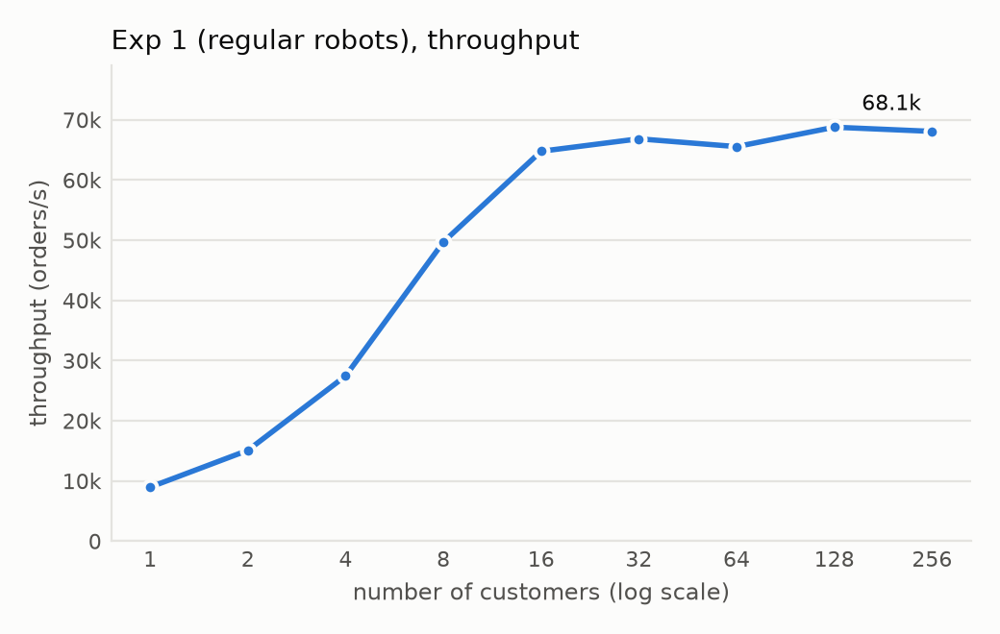
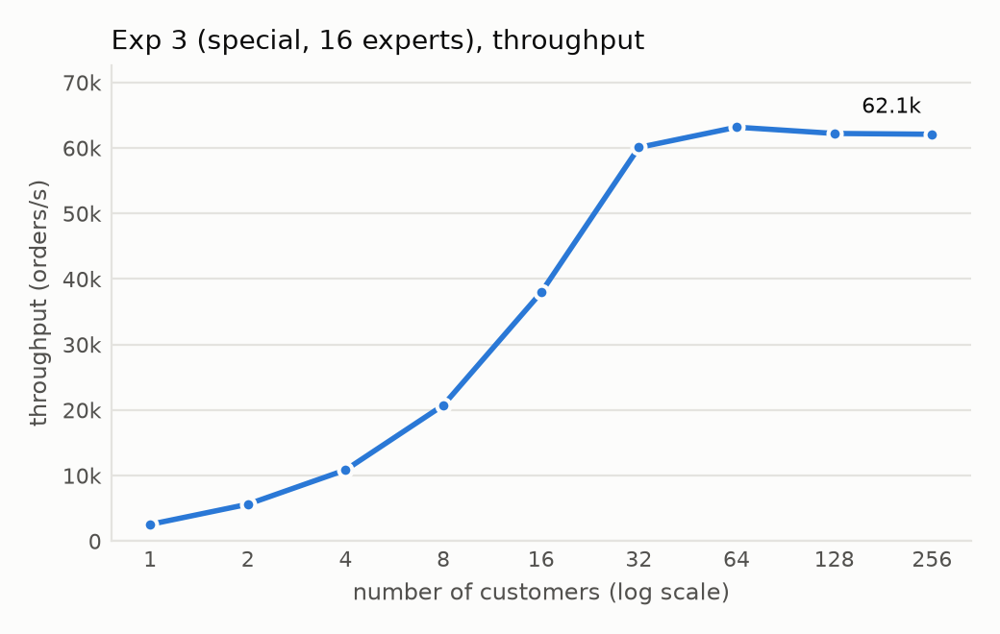

# Multi-Threaded C++ RPC Server

A client–server RPC system over TCP in C++, with hand-written marshalling, a thread per connection, and a shared worker pool coordinated by a mutex, a condition variable, and promise/future hand-off. Benchmarked across two 4-core Linux machines.

**Highlights**
- **68K requests/s** sustained across two machines (256 concurrent clients).
- Fixed a throughput collapse of **up to 170x** at 256 clients: multi-second tail latency was traced to TCP listen-backlog overflow; raising the backlog from 8 to 1024 brought max latency down from seconds to tens of milliseconds.
- Worker-pool scaling: going from **1 to 16 workers raised throughput ~11x** (5.4K → 62K req/s) for requests that need a worker.
- Latency checked against **Little's Law** across 36 benchmark runs; clean under **ThreadSanitizer** and **AddressSanitizer**.

> Built for Northeastern CS 6650 (Building Scalable Distributed Systems), Programming Assignment 2. The domain in the code is a "robot factory": an *order* is a request, a *robot* is the response, *engineers* are per-connection threads, and *experts* are the shared worker pool.

## Architecture

```
 client machine                                  server machine
┌──────────────────────────┐   TCP (12 B req /  ┌───────────────────────────────────────────┐
│ N client threads          │   20 B response)   │ accept loop                               │
│  each: ClientStub ────────┼───────────────────►│  └─ 1 thread per connection ("engineer")  │
│  one request in flight    │                    │       ServerStub: ReceiveOrder/ShipRobot   │
│  per-thread latency stats │◄───────────────────┼─────── regular request → handled inline   │
└──────────────────────────┘                    │       special request:                     │
                                                 │         push {request, promise} ──┐        │
                                                 │         wait on future            │        │
                                                 │  shared FIFO queue + mutex + cv ◄─┘        │
                                                 │  worker pool ("experts", size E)           │
                                                 │    pop → process → promise.set_value()     │
                                                 └───────────────────────────────────────────┘
```

| Layer | Files | What it does |
|---|---|---|
| Wire format | `Message.h/.cpp` | Fixed-size messages; every field marshalled with `htonl`/`ntohl` so byte order never depends on the machine. Structs are never sent raw. |
| Transport | `Socket.h/.cpp` | Owns one fd (move-only, closes in destructor). `SendAll`/`RecvAll` loop until exactly *n* bytes, because TCP is a byte stream. `MSG_NOSIGNAL` so a dropped client can't kill the server with `SIGPIPE`. `SO_REUSEADDR`, backlog 1024. |
| RPC stubs | `ClientStub`, `ServerStub` | Hide sockets behind `OrderRequest()` / `ReceiveOrder()` / `ShipRobot()`. Return `bool` so "peer closed" is distinguishable from a real message. |
| Server concurrency | `ServerFactory.h/.cpp` | Thread per connection; one shared FIFO queue protected by a mutex; workers wait on a condition variable with a predicate; each request carries a `std::promise`, so the result goes back to exactly the thread that asked — without holding the lock while waiting. |
| Load generator | `ClientMain.cpp`, `ClientThread.*` | One thread per simulated client, one request in flight each; per-thread min/mean/max written to a pre-sized slot, merged after `join()` (no locking on the hot path). |

## Results

Setup: client and server on two separate 4-core Linux machines; each data point ran 11–20 s. Full numbers are in [`experiments/results/`](experiments/results).

| Experiment | What varies | Result |
|---|---|---|
| 1 · requests handled inline | clients 1 → 256 | Throughput grows 9.0K → 64.8K req/s up to 16 clients, then plateaus at **65–68K req/s** (machine-bound). |
| 2 · every request needs the **single** worker | clients 1 → 256 | Plateaus at **~5.4K req/s** from 2 clients on — one shared worker is the bottleneck (~184 µs per request). |
| 3 · **16** workers | clients 1 → 256 | Scales to **~62K req/s** — about **11x** experiment 2. |
| 4 · workers = clients | clients 1 → 256 | Tracks experiment 3 up to 16, then flattens at ~50K req/s: beyond the core count, extra threads add context-switch cost instead of capacity. |

<p>
  
  
</p>

**Sanity check with Little's Law.** Each client has exactly one request in flight, so mean latency ≈ clients / throughput. At 256 clients in experiment 1: 256 / 68.1K ≈ 3.76 ms predicted vs **3.49 ms** measured.

### The tail-latency bug
With the default listen backlog of 8, a 256-client run showed **max latencies of 3.3–29.7 s** and up to **170x lower throughput**. When 256 clients connect at once, the accept queue overflows; the most likely mechanism is that the kernel drops the excess connection attempts and TCP retries them after exponential back-off (1, 2, 4, 8 … s), and that wait lands inside the measured latency. Raising the backlog to 1024 removed the effect (max latency at 256 clients in experiment 1: **38 ms**).
*Caveat:* the before-numbers came from a local run and the after-numbers from the two-machine setup; the back-off mechanism is inferred, not traced with packet captures.

## Build and run

Requires Linux, `g++` with C++11, and `make`.

```bash
cd src && make
./server <port> [#workers]                                   # ports 10000–65535; #workers defaults to 1
./client <server_ip> <port> <#clients> <#requests_per_client> <request_type: 0=inline, 1=worker>
```

Reproduce an experiment from the client machine (writes `experiments/results/exp<N>.csv`), then plot:

```bash
./experiments/run_experiment.sh <1-4> <server_ip> <port> [server_host]
python3 experiments/plot_results.py
```

## What I'd do next
- Replace thread-per-connection with an `epoll` event loop and compare throughput and tail latency at 256+ clients.
- Report p50/p99 instead of only min/mean/max, and capture CPU utilization to confirm where experiment 1 saturates.
- Re-run the backlog experiment with both settings on the same two-machine setup, plus a packet capture, to turn the inferred mechanism into a measured one.
